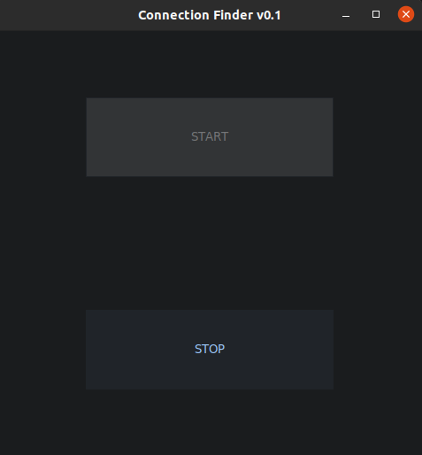
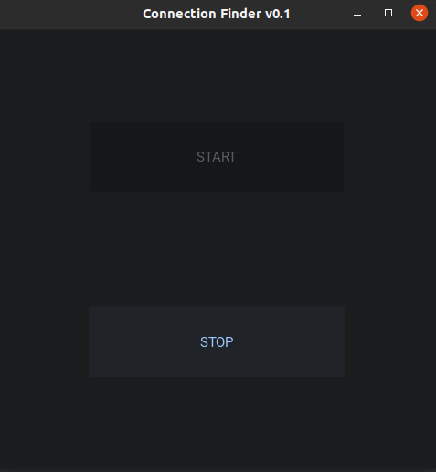
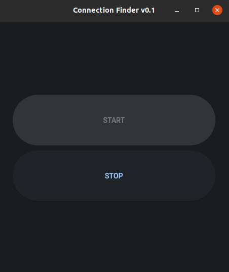

# Internet Connection Finder

---

## Overview

This Python project is designed to check the availability of an internet connection on your current device. It features
a simple user interface with two buttons: "Start" and "Stop." The "Start" button allows you to search for an internet
connection. If a connection is found, it plays a sound and enables the button. If a connection is not present, it
disables the button and continuously sends connection requests until a connection is established. The "Stop" button
allows you to halt the search and stop any sound that may be playing.

## Purpose

The point was to implement the same functionality with a similar appearance of the application, but using different 
graphics libraries. Therefore, the project uses 3 graphic libraries, between which you can easily switch.

## Usage

You can choose between two different user interfaces (UI) for this application: Tkinter, Flet or Kivy. To use the application,
follow the steps below:

1. **Install the required dependencies:**
   ```bash
   pip install requirements.txt
   ```

2. **Import the necessary components in your Python script:**
   ```python
   from connection_finder import ConnectionFinder
   from connection_finder.types import UIOptionString, UIOption
   ```

3. **Define the main function in your script, which initializes and starts the application. Choose either
   UIOption.TKINTER, UIOption.FLET or UIOption.KIVY to specify the UI you want to use:**
   ```python
   def main(option: UIOptionString) -> None:
       starter = ConnectionFinder()
       starter.start(option)
   
   if __name__ == "__main__":
       main(option=UIOption.TKINTER)  # Use UIOption.FLET or UIOption.KIVY to use the Flet or Kivy UI 
   ```

4. Run your Python script, and the Internet Connection Finder application will be launched with the chosen UI.

# Examples

<table>
  <tr>
    <th>Tkinter UI</th>
    <th>Kivy UI</th>
    <th>Flet UI</th>
  </tr>
  <tr>
    <td>
      <div style="text-align:center; border-radius: 5%; overflow: hidden; margin: 0 auto;">
        
      </div>
    </td>
    <td>
      <div style="text-align:center; border-radius: 5%; overflow: hidden; margin: 0 auto;">
        
      </div>
    </td>
    <td>
      <div style="text-align:center; border-radius: 5%; overflow: hidden; margin: 0 auto;">
        
      </div>
    </td>
  </tr>
</table>

# Licensing

This project is released under the MIT License. You are free to use and modify the code as needed.